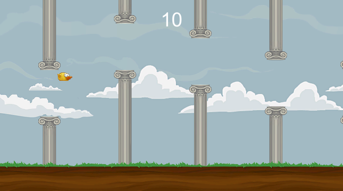

# Flappy Bird with Skills

This repository is the first game i made in unity. I make flappy bird with additional skills.

**Flappy Bird** is an arcade-style game in which the player controls the bird Faby, which moves persistently to the right. The player is tasked with navigating Faby through pairs of pipes that have equally sized gaps placed at random heights. (Source: [Wiki](https://en.wikipedia.org/wiki/Flappy_Bird))

## Running The App

- Play project in unity
- After that, click "Start" button
- To play the game, press "Space" to make bird do jump and you can use skills
- If bird died, the game will automatically restart in 2 seconds
- If you want to pause the game, press "Escape"
- To quit the project, click Play again in unity

## Resource

This project uses assets from [Unity Store](https://assetstore.unity.com/packages/templates/flappy-bird-style-example-game-80330). 

## Skills
- Q - Invunerable
- W - EZ Way
- Coming soon...

## Previews

